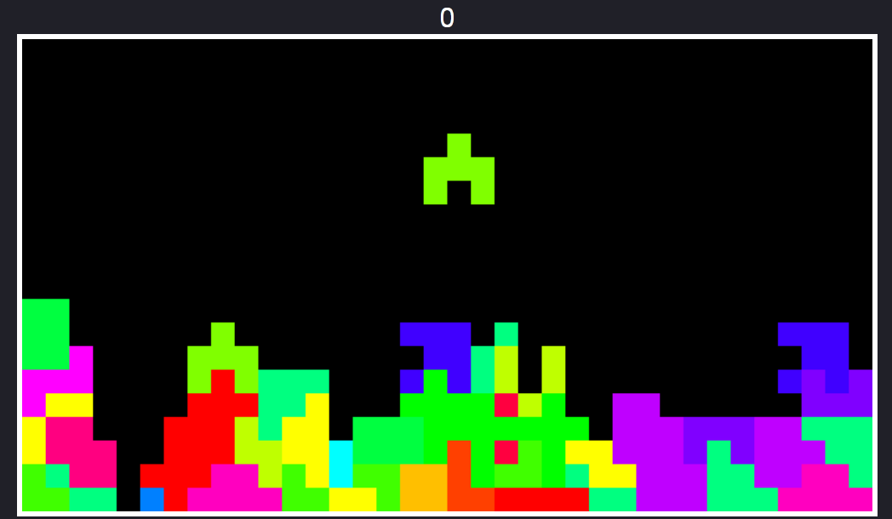

# Extended-Tetris-Game
Tetris game with extended selection of tiles written in HTML, JavaScript

# Features:
* Tetris Game with 36 different shape of tiles
* Extra-wide game field
* Each shape with different color
* Points counter

# Buttons:
* Up-, Down-, Left-, Right arrow keys to move tiles
* W - to rotate tile clockwise
* Q - to rotate tile counter-clockwise

# GOOD LUCK !
